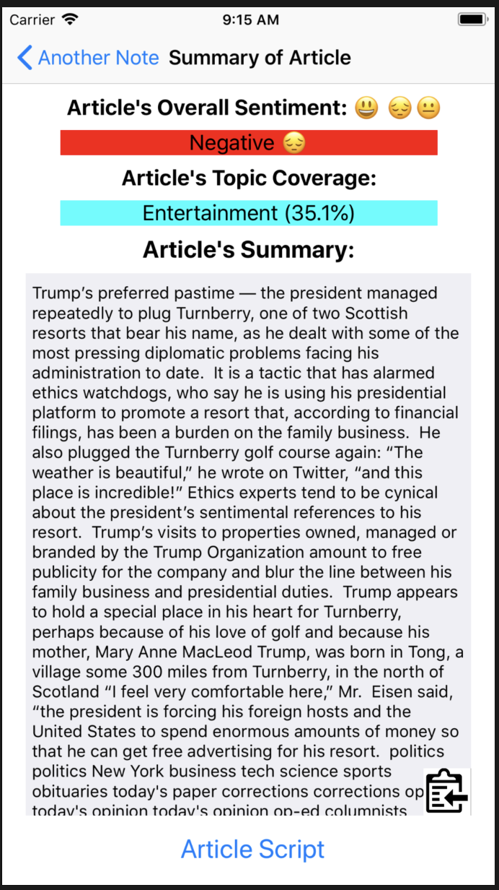

# College-NoteTaker

An application that allows easier and more efficient note taking by:
- allowing speech to text for faster note-taking and ease in writing
- ability to add articles and fully interpret through sentiment analysis and subject classification
- having a capability to summarize text for article and note summaries

## Model

### Summarizer

## Requirements

## Installation

## Built With

## Creator

## Note

The application can be useful in several settings such as real-time transciption of a professor, or reading a textbook out loud for studying purposes. Furthermore, the app can be used in meetings as a final summarizer for everything that was spoken.
